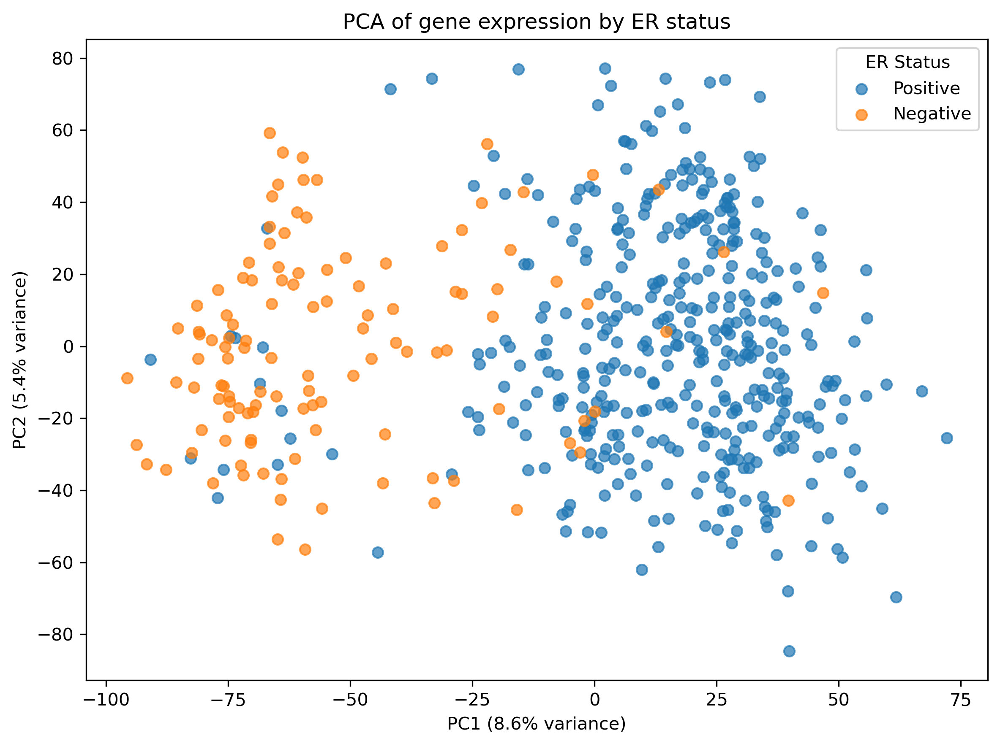
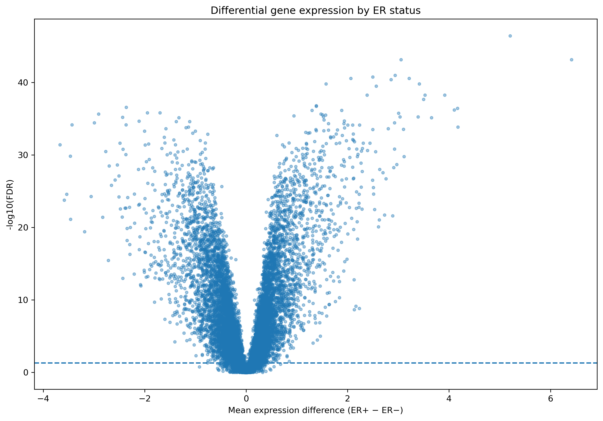
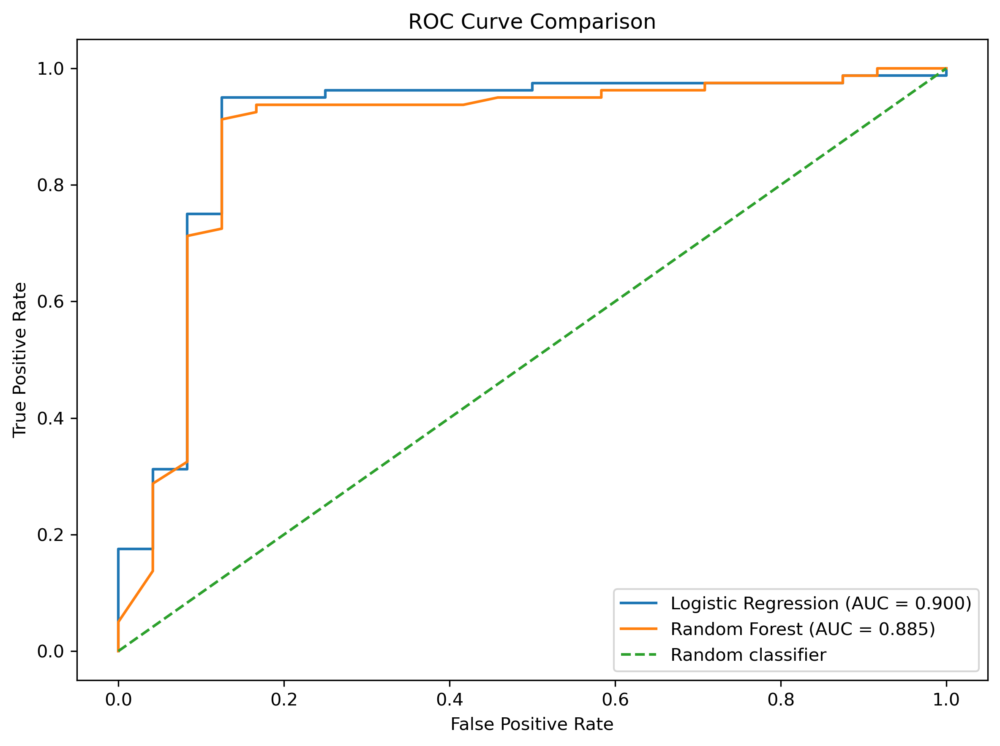
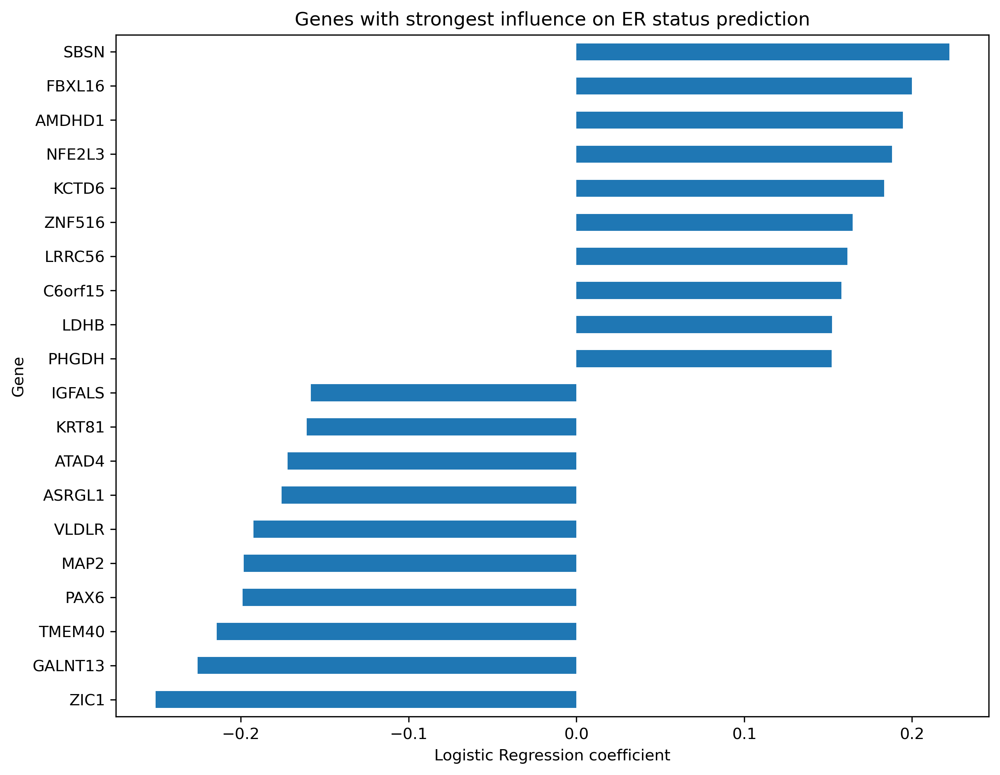

# Breast Cancer ER Status: Gene Expression Analysis & Machine Learning

## Overview

This project explores gene expression patterns associated with estrogen receptor (ER) status in breast cancer and evaluates whether gene expression profiles can be used to predict ER-positive and ER-negative samples.

The analysis combines exploratory data analysis, statistical testing and supervised machine learning in a two-stage workflow:

1. **Exploratory and differential expression analysis** (`01_data_exploration.ipynb`)
2. **Leakage-controlled machine learning and model interpretation** (`02_machine_learning.ipynb`)

The main objective is not only to build a predictive model, but to connect statistical analysis with machine learning and biological interpretation.

---

## Research Question

**Can gene expression profiles distinguish ER-positive from ER-negative breast cancer samples, and which genes contribute most strongly to this classification?**

---

## Dataset

The project uses breast cancer gene expression (Agilent microarray, log2 ratio to reference) and clinical data.

After matching the expression and clinical datasets, **519 samples** with available ER-status information were retained.

The expression dataset contained:

- **519 samples**
- **17,268 gene probes**, mapping to **17,264 unique gene symbols** after resolving duplicated probes (some genes are targeted by more than one probe on the microarray; these are consolidated by averaging)
- **401 ER-positive samples**
- **118 ER-negative samples**

ER status was encoded as a binary target:

- `1` → ER-positive
- `0` → ER-negative

---

# 01 — Exploratory Data Analysis

The first notebook investigates the global structure of the gene expression data and identifies genes associated with ER status.

## Principal Component Analysis

PCA was used to reduce the dimensionality of the expression data and visualize the main sources of variation.

The first two principal components (8.6% and 5.4% of total variance, respectively) showed a **partial separation** between ER-positive and ER-negative samples: ER-negative samples cluster predominantly at negative PC1 values, while ER-positive samples span a wider range, with substantial overlap in the central region. This indicates that ER status is associated with a real transcriptional signal, although it is not the only source of variation in the dataset — expected, given that thousands of genes and other sources of biological variability contribute to overall expression patterns.

The genes contributing most strongly to the separation were then examined, confirming that established ER-pathway markers (**ESR1**, **GATA3**, **FOXA1**) show markedly higher expression in ER-positive samples — a useful sanity check that the analysis recovers biologically expected patterns.

## Differential Expression Analysis

Gene expression was compared between ER-positive and ER-negative samples using the **Mann–Whitney U test**, a non-parametric test that does not assume normally distributed expression values.

Because thousands of genes were tested simultaneously, p-values were corrected using the **Benjamini–Hochberg procedure** to control the false discovery rate (FDR). Using FDR < 0.05 alone retained the large majority of genes tested, so an effect-size criterion was added: since expression values are on a log2 scale, a mean difference of 1 corresponds approximately to a 2-fold change in relative expression.

Genes were selected using:

- `FDR < 0.05`
- `|mean expression difference| ≥ 1`

This identified **950 candidate genes** in the exploratory analysis (using all 519 samples). This process was later repeated using only the training subset to select the genes used for machine learning (see below), which is why the two notebooks report a different number of selected genes.

## Volcano Plot

The volcano plot visualizes, for every gene, the relationship between effect size (x-axis: mean expression difference, ER+ minus ER−) and statistical significance (y-axis: −log10 FDR). The genes with the strongest combined effect size and significance included **ESR1**, **GATA3**, **AGR3** and **CA12** — all biologically consistent with the ER-positive phenotype.

---

# 02 — Machine Learning

The second notebook evaluates whether the expression patterns identified during exploration can be used to predict ER status in previously unseen samples.

## Train-Test Split

The 519 matched samples were divided into:

- **415 training samples**
- **104 test samples**

The split was stratified to preserve the ER-status distribution. The test set was kept completely independent until final model evaluation.

## Feature Selection

To avoid data leakage, feature selection was repeated **exclusively within the training set** rather than directly reusing the 950 genes identified in the exploratory analysis.

Genes were selected using the same criteria as above (Mann–Whitney U test, Benjamini–Hochberg FDR correction, FDR < 0.05, |mean expression difference| ≥ 1), applied only to the 415 training samples. This resulted in **1,009 selected genes** for machine learning.

## Preprocessing

Missing values were imputed using gene-specific medians learned from the training set. For Logistic Regression, gene expression was subsequently standardized using parameters learned exclusively from the training data. The same learned parameters were applied to the test set, preventing information leakage in both steps.

---

# Model Performance

Two complementary classification models were evaluated on the same independent test set:

| Model | Accuracy | Precision | Recall | F1-score | ROC-AUC |
|---|---:|---:|---:|---:|---:|
| **Logistic Regression** | **0.923** | **0.962** | **0.938** | **0.949** | **0.900** |
| Random Forest | 0.904 | 0.938 | 0.938 | 0.938 | 0.892 |

**Logistic Regression achieved the best overall performance**, with 92.3% accuracy, a 0.949 F1-score and a 0.900 ROC-AUC. Random Forest performed comparably but slightly below it. The results suggest that a relatively simple linear model was sufficient to capture much of the predictive signal present in the selected gene expression features.

---

# Model Interpretation

The Logistic Regression coefficients were examined to identify genes contributing most strongly to ER-status prediction. Positive coefficients push the prediction towards ER-positive status; negative coefficients push it towards ER-negative status.

**Strongest ER-positive direction:** SBSN, FBXL16, AMDHD1, NFE2L3, KCTD6, ZNF516, LRRC56

**Strongest ER-negative direction:** ZIC1, GALNT13, TMEM40, PAX6, MAP2, VLDLR, ASRGL1

The genes identified by the predictive model do not necessarily correspond to those showing the largest individual expression differences. This is expected, because differential expression and Logistic Regression answer different questions:

- **Differential expression** identifies genes with strong individual differences between ER-positive and ER-negative samples.
- **Logistic Regression** evaluates the contribution of genes jointly within a multivariate predictive model.

Because gene expression features are often correlated, a gene with a large individual difference does not necessarily provide the greatest *additional* predictive value once other, correlated genes are already included in the model. Among the 40 genes with the strongest Logistic Regression coefficients, only **PGR** and **SOX11** were also among the 40 genes with the largest absolute expression differences — illustrating that statistical association and predictive contribution are related but distinct properties of a gene.

---

# Key Findings

1. **ER status is associated with a real transcriptional signal.** PCA revealed a partial but consistent separation between ER-positive and ER-negative samples.
2. **Differential expression identified numerous ER-associated genes**, including established markers (ESR1, GATA3, AGR3, CA12, FOXA1), supporting the biological validity of the analysis.
3. **Gene expression can predict ER status.** Using only features selected from the training data, Logistic Regression achieved a ROC-AUC of 0.900 on the independent test set.
4. **Model complexity did not improve performance.** Random Forest performed comparably to, but not better than, Logistic Regression, suggesting the main predictive signal is largely linear.
5. **Statistical and predictive analyses provide complementary information.** The genes with the largest individual expression differences were not necessarily the genes with the strongest contribution to the multivariate predictive model.

---

# Limitations

This project is intended as a computational analysis and proof of concept, not a clinical prediction model.

- The analysis uses a single dataset; an independent external validation cohort was not available.
- Model evaluation is based on a single train/test split rather than cross-validation, so performance estimates carry some variance.
- The sample size is relatively small compared with the number of gene features.
- Feature selection was performed on the available training set and may be dataset-specific.
- Hyperparameters were not extensively tuned; default or lightly adjusted settings were used.
- Logistic Regression coefficients indicate predictive contribution within this model and should not be interpreted as evidence of biological causality.

---

# Technologies

The analysis was performed in Python using:

- **Python**, **NumPy**, **pandas**
- **SciPy**, **statsmodels** (statistical testing and FDR correction)
- **scikit-learn** (machine learning)
- **Matplotlib**, **Seaborn** (visualization)
- **Jupyter Notebook**

AI coding assistants were used during development to accelerate implementation of statistical and machine learning techniques studied independently, and to support debugging and code review.

---

# Conclusions

This project demonstrates a complete workflow for high-dimensional biological data analysis, from exploratory analysis and statistical testing to supervised machine learning and model interpretation.

The combination of PCA, differential expression analysis and predictive modelling showed that ER-positive and ER-negative breast cancer samples exhibit distinct gene expression patterns that can be used for accurate classification. The final results also illustrate an important distinction between **statistical association and predictive importance**, highlighting why combining classical statistical analysis with machine learning can provide a more comprehensive view of high-dimensional biological datasets.
